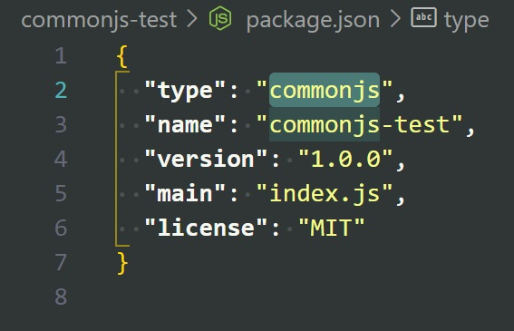
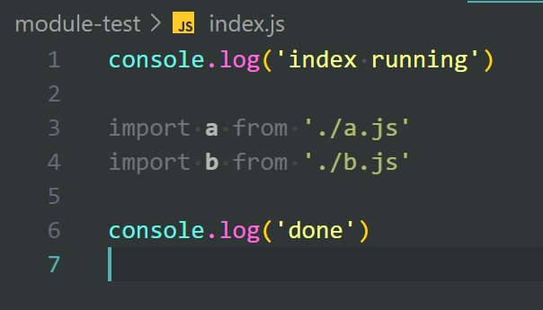
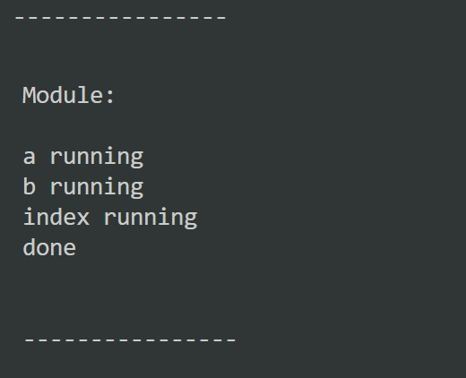

# CommonJS vs Module Comparison

This repository shows the difference between CommonJS (`require`, `module.exports`) and Module (`import`, `export`) Node implementation.

|                                           |                                         |
| ----------------------------------------- | --------------------------------------- |
| CommonJS                                  | Module                                  |
|       |       |
|  |  |
|        |        |

# Observations and Resume

Even though the code is identical and the only thing that differs is the imports, the order of code execution differs drastically.

For CommonJS, the flow is structured, synchronous, top-to-bottom. Whenever there's a `require`, Node runs the referenced `.js` file, loads the `module.exports`, and only then continues next.  
If there is a `console.log` first and `require` second, the `console.log` runs first, `require` runs second.

For Module, however, the flow changes slightly. First all the imports are loaded and executed (regardless of where in the file they are located), and only after that the actual code runs (everything that's not an import in the order top-to-bottom).
If there is a `console.log` first and `import` second, all the `import` statements run first regardless of where they are located in the file, then the `console.log` and all the code runs top-to-bottom (skipping `import` statements).

It is important to keep this in mind when using the new Node Module import type feature.
